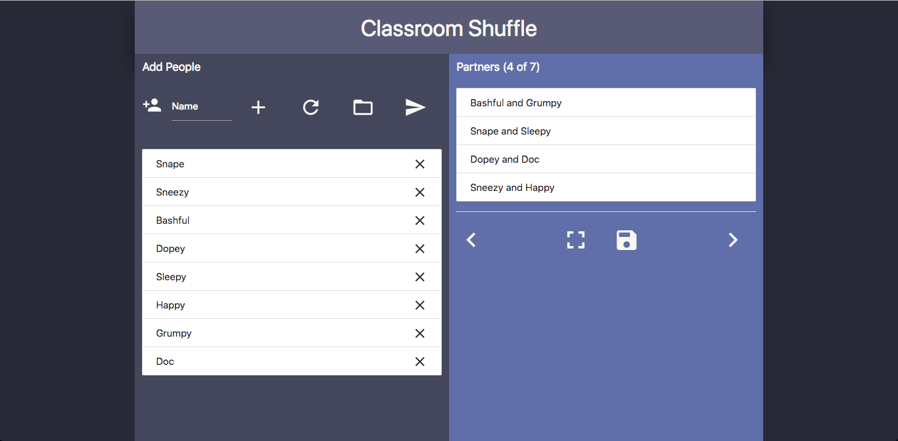

# Classroom Shuffle

This web application allows the user to enter people and create up to twenty (If possible) different combinations of partnerships. You can also save created partnerships and people for future use.

## Link

> [Classroom Shuffle](https://lukehalasy.github.io/Classroom-Shuffle/#!)
